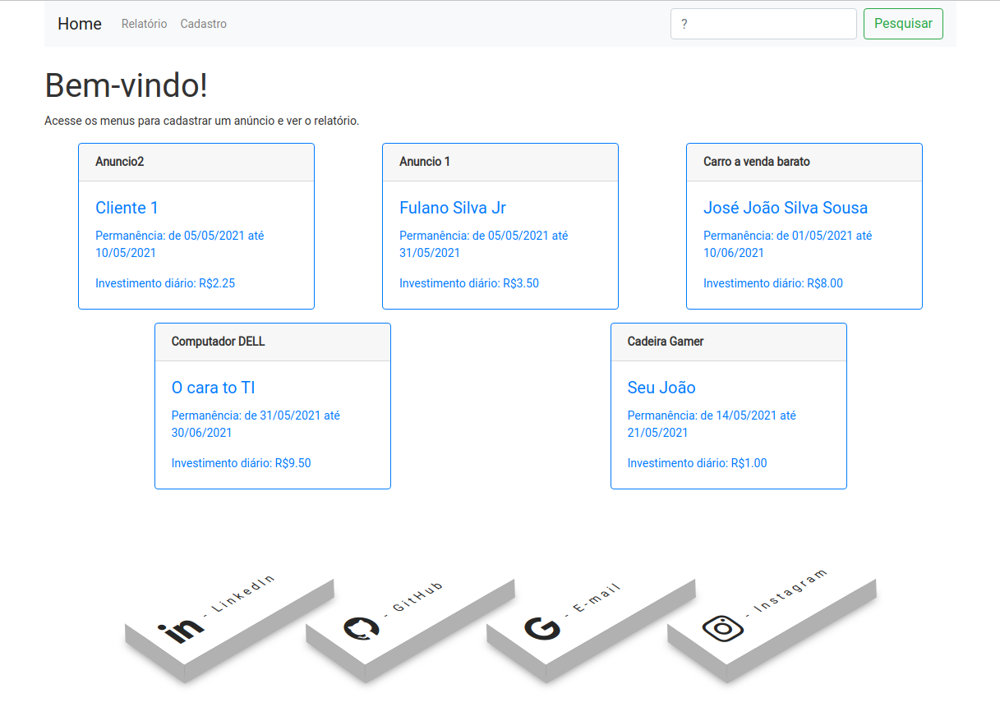

# Anúncios


Este é um projeto (Front-end) para cadastro de anúncios.

> O projeto foi gerado com [Angular CLI](https://github.com/angular/angular-cli) na versão 11.2.11.

O que foi utilizado:
- [Angular](https://angular.io/)
- TypeScript
- [Bootstrap](https://getbootstrap.com/docs/4.0/getting-started/introduction/)
- REST API
- [SeetAlert 2](https://sweetalert2.github.io/)

## Executando a aplicação

Antes de iniciar a aplicação, deve-se rodar o comando ```npm install``` para instalar as dependências do projeto.

Após instalar as dependências necessárias, iniciamos a aplicação com o seguinte comando:
```
$ npm start
OU
$ ng serve
```

Isso irá iniciar o front-end no endereço `http://localhost:4200/`. A aplicação irá atualizar automaticamente sempre que existir uma modificação.

## Telas do sistema

### Home

<kbd>
  
</kbd>


### Cadastro

<kbd>
  
</kbd>


### Relatório

<kbd>
  
</kbd>

<br>
<br>
<br>

> Tenho mais projetos :wink:, acesse [meu GitHub](https://github.com/HarllanAndrye).

