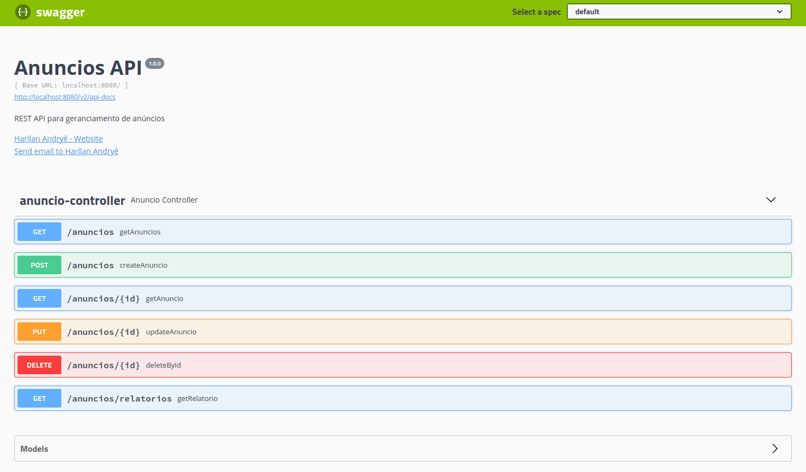

# API REST Cadastro de anúncios


Esta API foi desenvolvida para cadastrar anúncios e fornecer um relatório sobre os mesmos.

**O Anúncio tem:**
- Nome do anúncio
- Nome do cliente
- Data de início
- Data de término
- Investimento por dia

**O sistema fornecerá os relatórios de cada anúncio contendo:**

- Valor total investido
- Quantidade máxima de visualizações
- Quantidade máxima de cliques
- Quantidade máxima de compartilhamentos

Pré-requisitos para executar o projeto:
- Java 11 (foi utilizado o openjdk-11);
- Maven 3.6.3;
- Spring Boot 2.4.5;
- IDE de sua escolha (utilizei o [STS](https://spring.io/tools)).

O banco de dados utilizado é o H2 (banco de dados relacional escrito em Java).

### :computer: Rodar a aplicação
---

Para executar o projeto no terminal, digite o seguinte comando:

```shell script
$ mvn spring-boot:run
```

Após executar o comando acima, o seguinte endereço da API estará disponível:

```
http://localhost:8080/anuncios
```

Foi utilizado o Swagger 2 para Spring REST web service, usando a biblioteca [Springfox](https://github.com/springfox/springfox).
O Springfox irá retornar um JSON com as informações da documentação da API e para verificar se está funcionando, acesse: 

```
http://localhost:8080/v2/api-docs
```

Mas, para melhor visualização das informações, usamos o Swagger UI, no endereço:

```
http://localhost:8080/swagger-ui.html
```

<kbd>
  
</kbd>

<br>
<br>

Fluxo da API:
```
Controller > Service > Repository > Entity
```

### :x: Erro com Eclipse IDE
---

Após importar o projeto na IDE Eclipse, pode ocorrer o seguinte erro:

```shell script
__ cannot be resolved to a type BeerController.java	/beerstock/src/main/java/one/digitalinnovation/beerstock/controller	line ...
```

Esse erro é devido ao Eclipse não reconhecer a biblioteca [Lombok](https://projectlombok.org/), que é utilizada no projeto para ajudar a escrever menos código usando anotações que gera métodos automaticamente.

Para resolver esse problema é necessário instalar o Lombok no Eclipse e [esse link pode ajudar](https://howtodoinjava.com/automation/lombok-eclipse-installation-examples/) no passo a passo de como fazer a instalação.
